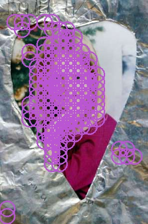
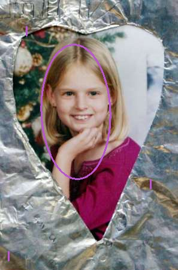
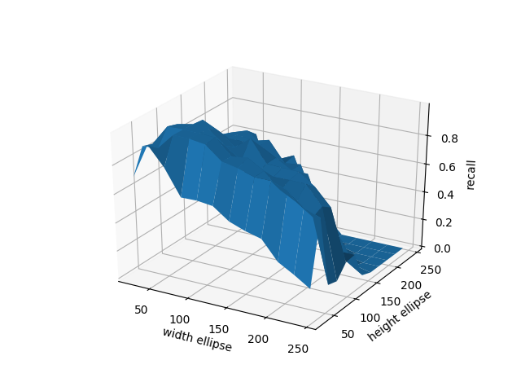
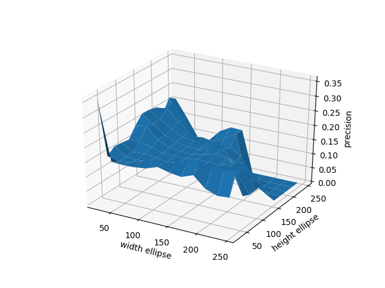

# Projet 1 : détection de visages avec des histogrammes de couleurs de peau
###### Yoan Souty, Antonin Klopp-Tosser, Florent Geslin

&nbsp;&nbsp;&nbsp;&nbsp;&nbsp;&nbsp;Le rapport présente tout d'abord l'implémentation faite pour les trois challenges, puis présente une analyse des performances afin de déterminer les paramètres optimaux correspondant aux trois challenges et comparer l'efficacité de nouvelles options.

## I. Les choix d'implémentation

&nbsp;&nbsp;&nbsp;&nbsp;&nbsp;&nbsp;L'algorithme de détection de visages par inférence Bayésienne se décompose en trois étapes i.e _challenges_.

&nbsp;&nbsp;&nbsp;&nbsp;&nbsp;&nbsp;Le premier _challenge_ attribue à chaque pixel $I(i,j)$ d'une image en couleur $I$ une probabilité $P(i,j)$ qu'il soit de la peau. Pour calculer cette probabilité, on utilise deux histogrammes : $H, H_T$ où $H$ compte l'ensemble des pixels dans le set d'images utilisés pour l'entraînement et $H_T$ compte les pixels de peau dans ce _data set_. Les performances du _challenge 1_ dépendent des paramètres suivants :

* $Q$ : facteur de quantification des histogrammes
* représentation des couleurs : espace couleur RGB et espace chrominance rg

&nbsp;&nbsp;&nbsp;&nbsp;&nbsp;&nbsp;Le _challenge 2_ désigne le passage d'une fenêtre coulissante afin de repérer dans l'image des probabilités $P(i,j)$ les Régions d'Intérêt (ROI) pouvant contenir un visage. Nous avons choisi d'utiliser directement une fenêtre elliptique afin de ne pas se soucier des valeurs situées aux bords de la fenêtre carrée. Nous avons paramétré plusieurs parcours de la fenêtre coulissante avec un nombre de tailles d'ellipses et un nombre d'orientation pour chaque taille. Les performances du _challenge 2_ dépendent des paramètres suivants :

* $(w, h)$ : largeur et hauteur de l'ellipse d'origine
* $\# scales$ : nombre d'échelles d'ellipses à partir de l'ellipse d'origine
* $\# angles$ : nombre d'angles (en degré) choisi entre 0° et 180°
* $B$ : valeur du biais

&nbsp;&nbsp;&nbsp;&nbsp;&nbsp;&nbsp;L'ensemble de visages détectés obtenu par le _challenge 2_ doit ensuite être traité afin de garder un maximum de visages différents. Pour cela, nous avons choisi de comparer deux approches différentes : la première est la suppression du non-maximum présentée dans le sujet, où l'on ne garde que les ellipses avec la plus grande vraissemblance en définissant une distance pour déterminer le voisinage entre deux ellipses. La deuxième consiste à utiliser une distance entre ellipses afin de les regrouper pour prendre l'enveloppe convexes de tous les groupes d'ellipses formés. Les performances du _challenge 3_ dépendent des paramètres suivants :

* choix de la distance entre ellipse : distance euclidienne vs. distance de Mahalanobis
* $R$ : distance maximale pour que deux ellipses soient considérées comme "voisines"

## II. Mesurer les performances

&nbsp;&nbsp;&nbsp;&nbsp;&nbsp;&nbsp;Nous avons ensuite mis en place plusieurs méthodes de mesure de performance. En effet pour rendre notre modèle le meilleur possible nous pouvons faire varier plus paramètres et nous devons pouvoir décider leurs valeurs optimales.
Pour se faire nous avons calculé/ tracé plusieurs indicateurs:
* la précision (precision)
* l'exactitude (accuracy)
* le rappel (recall)
* la courbe ROC

Pour calculer ces différents indicateurs, nous avons utilisé la bibliothèque slearn.

###### La précision
&nbsp;&nbsp;&nbsp;&nbsp;&nbsp;&nbsp; La précision permet de vérifier que lorsque que l'on indique qu'un pixel appartient à un visage on ne se trompe pas trop.

###### L'exactitude
&nbsp;&nbsp;&nbsp;&nbsp;&nbsp;&nbsp; L

###### Le rappel
&nbsp;&nbsp;&nbsp;&nbsp;&nbsp;&nbsp; Le rappel permet de vérifier qu'on oublie pas de visage quite à en détecter trop.
###### La courbe ROC
&nbsp;&nbsp;&nbsp;&nbsp;&nbsp;&nbsp; La courbe Reciver Operating Characteristic permet d'observé l'evolution des vrais positifs en fonction des faux positifs. Il est est donc intéressant d'obtenir une courbe ROC qui crois très vite pour des taux de faux positifs faible.

###### Notre choix:
Pour valider notre modèle, nous avons choisi de plus observer le recall pour ètre sur de détecter tous les visages même si on détecte un visage un peu trop large.

## III. Analyse des résultats

### 1. Paramètres du _challenge 1_

\# TODO : graphes des métriques avec la quantification $Q$ et le mode de couleurs => en déduire la meilleure quantification et le meilleur mode

### 2. Paramètres du _challenge 2_

\# TODO : même chose avec nombre d'angles et tailles initiales

### 3. Paramètres du _challenge 3_
\# TODO : même chose avec distance $R$ et comparer entre supprimer les ellipses et les regrouper en enveloppes convexes.

### 4. Enveloppe convexe elliptique

&nbsp;&nbsp;&nbsp;&nbsp;&nbsp;&nbsp; D'après les analyses précédantes, nous avons remarqué qu'en utilisant de petites ellipses, on obtenait de meilleurs résultats d'un point de vu métriques. Cependant, avec ces paramètres un visage et caractérisé par plusieurs ellipses... Pour réssoudre ce problème, nous avons mis en place une enveloppe convexe qui englobe toutes les ellipses détectées dans les deux premiers challenges.  
Pour tracer cette envoloppe nous avons utilisé deux algorithmes:
* Un algorithme de clustering pour patitionner l'espace
* Un algorithme d'envoloppe convexe elliptique

#### Density-Based Spatial clustering of Application with noise.

&nbsp;&nbsp;&nbsp;&nbsp;&nbsp;&nbsp;La première problème a ressoudre pour tracer l'envoloppe elliptique est de définir les groupes d'ellipses correspondant à un même visage. Pour cela nous avons utilisé un algorithme de clustering permettant de partitionner l'espace: Le DNSCAN. En effet cette algorithme permet de regrouper des points dans l'espace en plusieurs sous ensemble(cluster) de point dont le distance euclidienne ne dépasse pas une certain valeur. Ainsi nous avons appliqué cet algorithme en centre des différentes ellipses détectés par notre algorithmede reconnaissance de forme.  
De plus grâce à cet algorithme, nous avons pu effacé les detections non significatives(Contre par exemple une seule ellipse...)
Nous avons fait le choix de ne pas ré-implémenter cet algorithme car il est disponible en opensource dans la library python sklearn.cluster.

#### ellipse convexe:  

&nbsp;&nbsp;&nbsp;&nbsp;&nbsp;&nbsp; Une fois les groupes d'ellipses correspondant à un visage isolé, nous avons fait le choix de tracer une ellipse enveloppant toutes les ellipses detectés. Pour ce faire on a utilisé la fonction fitEllipse de openCV. En effet cet fonction permet de tracer sur une image une ellipse comprennant plusieurs points. Ainsi nous avons appliqué cette fonction aux groupes de points détectés par l'algorithme DBSCAN.

 

#### Impact sur les performances:

&nbsp;&nbsp;&nbsp;&nbsp;&nbsp;&nbsp; D'un point de vue performance, cette méthode permet de gagner en précision tout en maintenant les autres paramètres. Pour tracer des courbes, on a appliquer la méthodes précédante sur les petites valeurs de h et w (w, h < 75). et on obtiens les courbes suivantes:

On observe bien que le recall ne varie presque pas pour des ellipses petites.

Cependant on observe que la precision en est presque doublée(ici mesurée sur des paramètres arbitraire d'ou la valeur faible...)

On a donc bien une méthode améliorant la performance de notre algorithme.
